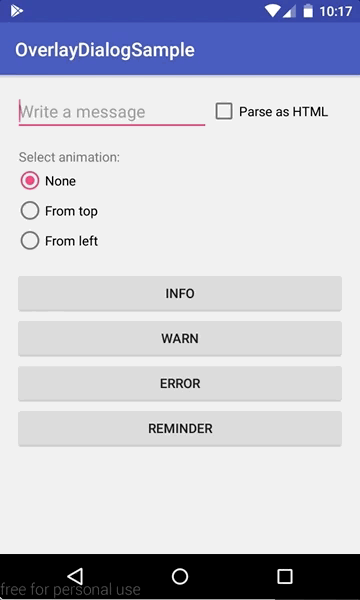

# android-overlay-dialog
A customizable dialog shown on top of the window

## Sample app

  

## How to use
Please, add the following dependency to your gradle file:
```
compile 'com.github.fernandospr:overlaydialog:1.0.1'
```

`OverlayDialog` inherits from `android.app.Dialog`, so you can use the same methods from Dialog, for example:
```
OverlayDialog dialog = new OverlayDialog(this);
dialog.setCancelable(true);
dialog.setContentView(customView);
...
dialog.show();
...
dialog.dismiss();
```

To customize the auto dismiss time, you should use:
```
dialog.setAutoDismissDelayMillis(5000);
```

To customize the enter/exit animations, you should create a theme and set it in the constructor, for example:
```
OverlayDialog dialog = new OverlayDialog(this, R.style.TopMessageDialog);
```

res/values/styles.xml
```
<style name="TopMessageDialog" parent="Theme.AppCompat.Dialog">
    <item name="android:windowAnimationStyle">@style/TopMessageDialogAnimation</item>
</style>

<style name="TopMessageDialogAnimation">
    <item name="android:windowEnterAnimation">@anim/translate_from_top</item>
    <item name="android:windowExitAnimation">@anim/translate_to_top</item>
</style>
```

res/anim/translate_from_top.xml
```
<?xml version="1.0" encoding="utf-8"?>
<set xmlns:android="http://schemas.android.com/apk/res/android"
    android:duration="600">
    <translate
        android:fromYDelta="-100%"
        android:toYDelta="0%" />
    <alpha
        android:fromAlpha="0"
        android:toAlpha="1" />
</set>
```

res/anim/translate_to_top.xml
```
<?xml version="1.0" encoding="utf-8"?>
<set xmlns:android="http://schemas.android.com/apk/res/android"
    android:duration="600">
    <translate
        android:fromYDelta="0%"
        android:toYDelta="-100%" />
    <alpha
        android:fromAlpha="1"
        android:toAlpha="0" />
</set>
```

See the sample app for more examples.
